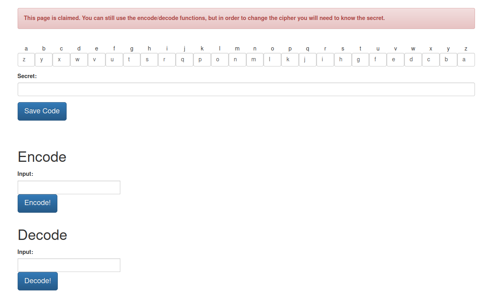
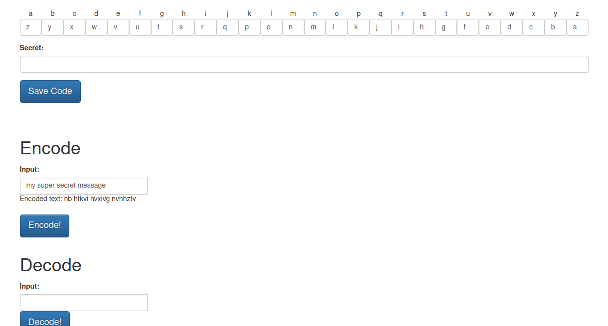
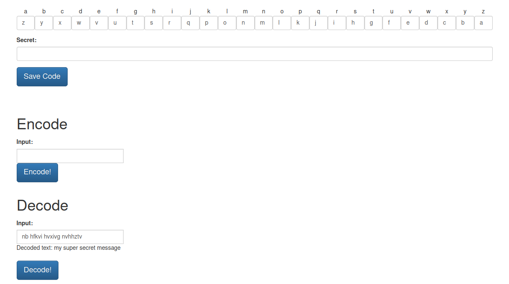

# Ethan's Code Creator

The Code Creator app is a simple Go web app that allows you to create basic substitution ciphers and then encode/decode text based on the created cipher. 
The idea came from watching my child exchange paper ciphers and messages with is friends at school. I thought it would be a neat project to turn into something web-based, 
so here we are!

**Please note that this is not intended to be a secure app and is for educational purposes only. It was designed with elementary school aged children in mind, and is meant to stir up interest in cryptography, nothing else :).**

This is an alpha quality app that is being provided as an MVP. 


# Building

Please note that this makes use of sqlite, and the [library](https://github.com/mattn/go-sqlite3) I am using requires cgo. I'm hoping to provide pre-built
binaries in the future, but for now you'll need gcc on your side to build this.


# Running

Start it up using any of the following flags:

```
Usage of ./ecc:
  -n	create new, empty database
  -p string
    	port number to listen on (default "8080")
  -t	run with TLS
```

If using TLS, it will try to auto-register a Let's Encrypt cert for you. If everything goes well, you should see something like this at `yourhost:yourport/dumdum` as ecc pre-populates the `dumdum` "cipher page" for you:




You can see the cipher at the top and what each letter maps to. This can be changed as long as you know the secret for the cipher page you are on :)

Below are examples of the encode and decode function:






